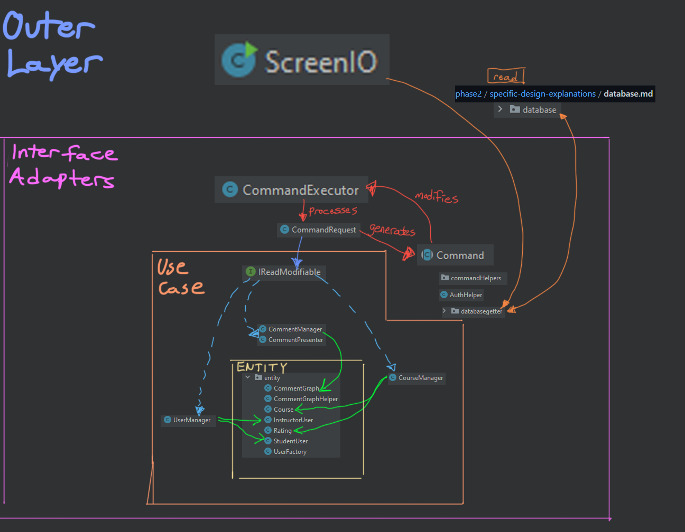

# Design document

This is our main design document.

** **IMPORTANT RELATED DOCUMENTS CAN BE FOUND IN THE [other-documents](https://github.com/CSC207-UofT/course-project-group-010/tree/main/phase2/other-documents) FOLDER** **

This includes the accessibility report. If you keep reading this document, you will naturally be redirected to the other documents. 

specific-design-explanations helps clarify our design choices. Reference it instead of looking through our code, for convenience.

## Main updates since phase 1 + updated specification

Our main update of this phase was implementing relative rating. This feature allows users to see average ratings filtered by the the programs of users who left ratings.

We also cleaned up a lot of unused methods, and made helper classes for certain commands and implemented strategy/factory patterns to satisfy the single responsibility principle(you can read about that below)

**For the updated specification, visit phase2/specification.md**

## Diagram of our code

You can check out resource/diagram.png for a larger version.

This is approximately how the classes in our program interact. Helper classes
were excluded. As shown, classes interact with the next layer of clean architecture.

## What each group member has worked on since phase 1

Go to [other-documents/progress_report.md](other-documents/progress-report.md) for more info

## Design Decisions we implemented in phase 2

In phase 2, we mostly implemented design patterns to clean up the code and make future development easier. This will
be discussed later. The only new feature we implemented is relativeRating.

CourseManager handles the calculation of course ratings. Each rating has a stored user object and a rating(double) object already.

To get relative rating, we simply filter the list of rating objects by programs and re-calculate a rating in CourseManager.
Thus, we only had to extend CourseManager rather than changing anything else. It was quite easy to implement.

However, we had to prompt the user to enter their program detail. We quickly noticed that we were prompting both
users and instructors to enter their program detail, and had to have some sort of IF statement to differentiate between them.
This is explained in our design patterns, under Controller.

**IMPORTANT:** We have a finite list of possible programs for now, that we can expand on later. We made ProgramConstants to
keep track of the list, satisfying the single responsibility principle.

## Design Patterns we used in phase 2

### Entity

- UserFactory(entity.UserFactory) uses the factory pattern to produce a user based on a specified type. Eg. if you specify UserTypes.STUDENT, it will give back a StudentUser.
  - Moves the creation of different users to another class, making the user initialization methods less cluttered.

### Use Case

- CoursePageBuilder and Director(useCase.coursePage) implement the builder pattern to build a coursepage(which sets the basic data, creates ratings, creates the comment section, etc.)
  - The process for building a course page is quite complex and involves creating many entities, so controllers can use this builder, that takes primitives as arguments, instead of passing in
  entities(which would not follow clean architecture).

### Controller

- UserBuilder(controller.commands.commandHelpers.UserBuilder) is an interface that helps process input for creating a new user(eg. user ID must follow a specific regex, so there is a method
  for checking that). This is a strategy pattern, as both StudentUserBuilder and InstructorUserBuilder(that implement this interface)
  can be used in controller.commands.NewUserCommand to help build a new user.
  The factory method pattern was implemented in NewUserCommand that gets the correct UserBuilder and runs the shared methods.
  - Follows single responsibility principle. The functions for taking user input, processing it, and creating a student were separated. The strategy
  pattern also allows us prompt students for their programDetail and instructors for their position without creating two createUserCommand classes.
- The same idea was implemented in controller.commands.CheckoutCommand. controller.commands.commandHelpers.PageGetter is a strategy, and CommentsPageGetter, CoursePageGetter and
  UserPageGetter all implement this interface. A factory method was created in CheckoutCommand to help implement this strategy pattern.
  - Follows single responsibility principle. We separated three getters into separate classes, rather than having an if else statement that does all 3 things.

Check out [specific-design-explanations/commands.md](specific-design-explanations/commands.md) for more details on this(if you need it).

- DataPrinter an example of the Facade pattern. In the print command, we noticed that the frontend team cares about how we process data gotten from the IGettable
  interface, and the backend team cares about how we get that data in the first place. Thus, controllers.commands.commandHelpers.DataPrinter is a class that has the single responsibility of
  processing a map for the purpose of frontend display, and the run() method in controllers.commands.PrintCommand simply gets the map to print, and delegates the printing part to this class. Therefore, it's somewhat
  of a Facade.

- CommandConstants uses the factory pattern to return the appropriate command when we enter a method(string). Eg. it maps "checkout" to new CheckoutCommmand(). This is used
  in CommandExecutor to execute many different objects that all derive the Command class.

#### Could we implement more design patterns?

Problably. Many classes have quite a few methods, and the Facade pattern could have been implemented. However, we didn't notice any significant breaches of the Single Responsibility Principle, as we're still
in the development phase and haven't identified too many different actors for a single class.
Thus, we are choosing not to implement the pattern, as it would create a lot of extra classes, and the TA already said we have a lot of classes.

## Clean architecture

Read [other-documents/clean architecture.md](other-documents/clean-architecture.md) for details on how our project follows clean architecture

Read [other-documents/CleanArchitectureDependencies.pdf](other-documents/clean-architecture-dependencies.pdf) to see our actual code dependencies, which show that clean architecture is followed.

**IMPORTANT** there's a single instance where clean architecture is not followed. SCROLL TO THE BOTTOM OF
[specific-design-explanations/database.md](specific-design-explanations/database.md) for more info.

## SOLID design principles

Read [other-documents/solid.md](other-documents/solid.md) for details on how our project follows SOLID principles.

## Packaging

Read [other-documents/packaging.md](other-documents/packaging.md) for more details on our packaging decisions

## Questions our group is struggling with

- We're just not sure if our classes follow the single responsibility principle, as we
haven't really envisioned what actors may be concerned with each class.
- Wouldn't it be better to map eg. UserType to strings? TAs and profs say an enum would be more simplitic,
but we have many methods that have the single responsibility of mapping UserType.STUDENT to "STUDENT" and UserType.INSTRUCTOR to "INSTRUCTOR."
Since it doesn't occur too much, we've kept it as an enum for now.

## What has worked well with our design

- Design patterns are implemented nicely, and helper methods were created to make the code more testable.
For commands, we could test helper methods rather than command methods(that often take user input).
  - eg. we could test the DataPrinter, instead of the print command.
- Interfaces are very good, and we are leveraging their shared methods very well in our program. Eg. the IGettable interface
allows us to run the print command on a lot of different pages.

## OTHER DOCUMENTS

- [Accessibility report](other-documents/accessibility.md)
- [Refactoring evidence](other-documents/refactoring.md)
- [Testing coverage](other-documents/testing.md)
- [Use of GitHub features](other-documents/Use%20of%20GitHub%20Features.md)
- [Code documentation and debugging](other-documents/code-documentation.md)
