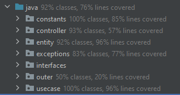

# Testing

We have test cases for all important features in the src/test/java folder

We used Junit's @Before and @After annotations.

You can rightclick src/test/java > run with coverage to look at our test coverage
(you may need to scroll down the coverage chart to see relevant classes)
(you may need to clear courses.ser and users.ser to make the tests pass, as it interferes with some of the tests)
Here is an image of our test coverage.

